# 🗺️ 공간데이터(SHP/ZIP) 미리보기 확장 프로그램
**Gongmiri**는 SHP/ZIP 공간데이터를 다운로드하는 즉시 브라우저에서 바로 미리볼 수 있는 Chrome Extension입니다.

## 왜 만들었나요?

공간데이터 분석을 진행할 때 우리는 주로 SHP(Shapefile) 파일을 다운로드해 활용합니다.  
하지만 이 파일 안에 실제로 어떤 데이터가 들어 있는지 확인하는 과정은 생각보다 번거롭습니다.

물론 컬럼 정의서를 통해 각 필드의 의미는 알 수 있습니다.  
그러나 **해당 컬럼이 실제 얼마나 채워져 있는지, 유효한 값이 포함되어 있는지**는 또 다른 문제입니다.

예를 들어, 컬럼 구조만 보고 "분석이 가능하겠구나"라고 기대했지만,  
막상 QGIS 같은 툴에서 열어보면 값이 대부분 `NULL`이거나, 기대했던 속성이 전혀 없는 경우가 흔합니다.

결국 실제 데이터를 확인하기 위해 매번 아래와 같은 과정을 반복해야 했습니다.

```
ZIP 다운로드 → 압축 해제 → QGIS 실행 → 레이어 추가 → 속성 테이블 확인 → 지도 분포 확인
```

한두 번이라면 괜찮지만, 다양한 데이터를 탐색해야 할 때에는  
단순 검증 작업만으로도 많은 시간과 노력이 들고, 워크플로우 또한 비효율적이라는 생각이 들었습니다.

그래서 이러한 불편함을 해결하고자,  
**다운로드한 Shapefile을 브라우저에서 즉시 열어보고 속성과 공간 분포를 빠르게 파악할 수 있는 크롬 확장 프로그램**을 만들고자 합니다.

## 설치 및 실행
- 요구사항: Node.js 18+ / npm, Chrome(확장 프로그램 로드용)
- 의존성 설치: `npm install`
- 개발 서버: `npm run dev` 후 http://localhost:5173 에서 뷰어 UI를 바로 확인(샘플 ZIP을 드래그 앤 드롭)
- 번들 빌드: `npm run build` (타입 체크 포함, 결과물은 `dist/`)
- 크롬 확장 로드: `chrome://extensions` → 개발자 모드 ON → "압축해제된 확장 프로그램을 로드" → `dist/` 폴더 선택. 빌드 후 변경 시 확장 페이지에서 "새로고침"을 눌러 반영.

## 주요 기능
- Drag & Drop / ZIP 자동 인식
- SHP / DBF / SHX / PRJ 로딩 및 검증
- DBF 문자 인코딩 자동 판별(CPG 우선)
- PRJ 기반 SRID 자동 추정 (4326/5179/5186/3857 등)
- 웹 워커 기반 비동기 파싱(대용량 데이터 대응)
- 포인트/라인/폴리곤 자동 스타일링
- 속성 테이블 & Geometry Summary 제공

## 기능별 화면 가이드


### 1) ZIP 업로드 · 파일 검사
- Shapefile ZIP Drag & Drop / 파일 선택
- `.shp/.dbf/.shx/(.prj|.cpg)` 필수 구성 검사
- 인코딩(CPG) · 좌표계(PRJ) 자동 감지
<table width="100%">
  <tr>
    <th width="50%">ZIP 업로드·검사</th>
    <th width="50%">파싱 진행 표시</th>
  </tr>
  <tr>
    <td width="50%">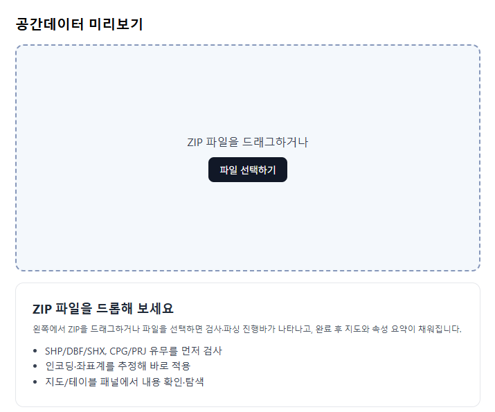</td>
    <td width="50%">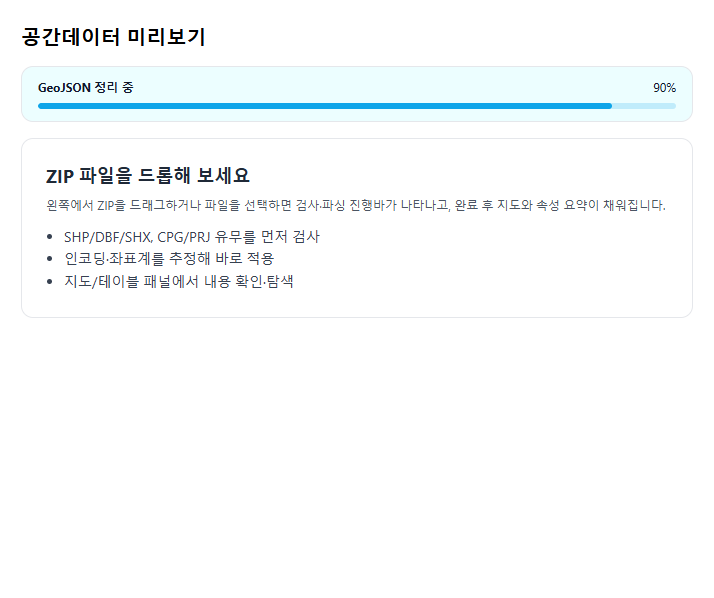</td>
  </tr>
</table>


### 2) 좌표계 선택 · 자동 재투영
- PRJ 기반 EPSG 자동 추정
- 4326 / 5179 / 5186 / 3857 등 사용자 지정 선택
- 선택 즉시 전체 GeoJSON 재투영
<table width="100%">
  <tr>
    <th width="50%">좌표계 선택</th>
    <th width="50%">좌표계 적용중</th>
  </tr>
  <tr>
    <td width="50%">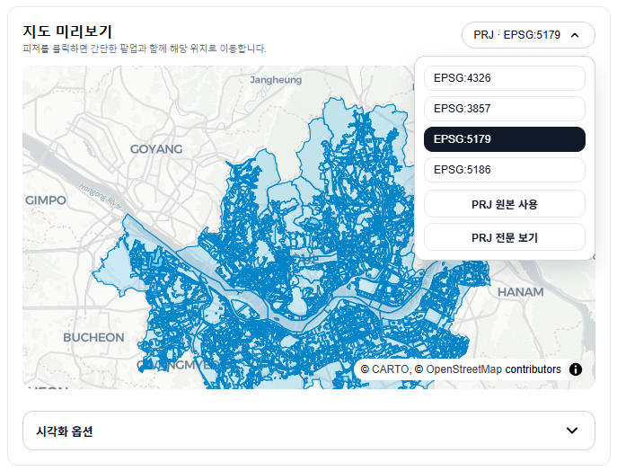</td>
    <td width="50%">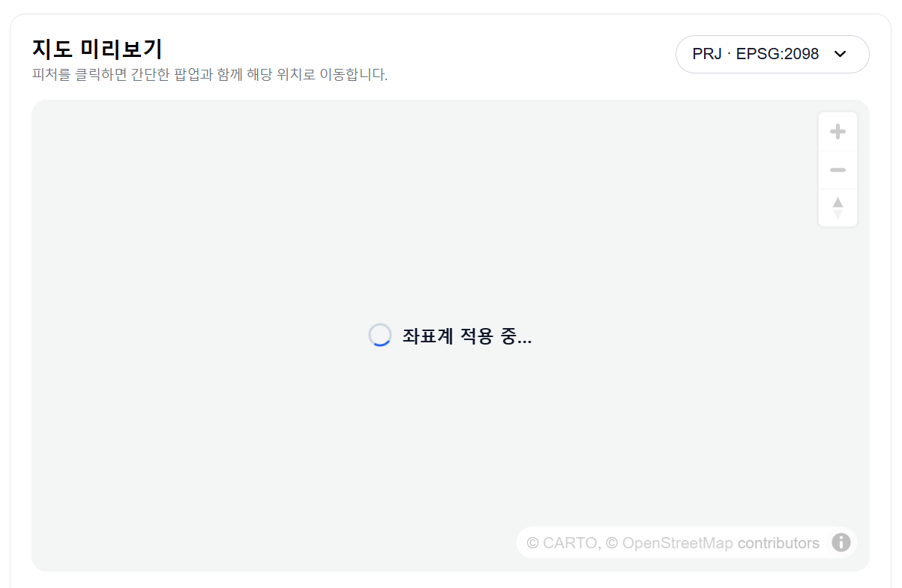</td>
  </tr>
</table>


### 3) 지도 렌더링 · 공간 시각화
- MapLibre 기반 베이스맵
- 포인트/라인/폴리곤 자동 스타일링
- 클릭 시 속성 팝업 · 피처 하이라이트

<table width="100%">
  <tr>
    <th width="50%">폴리곤 지도</th>
    <th width="50%">폴리곤 지도 색상 적용 결과</th>
  </tr>
  <tr>
    <td width="50%">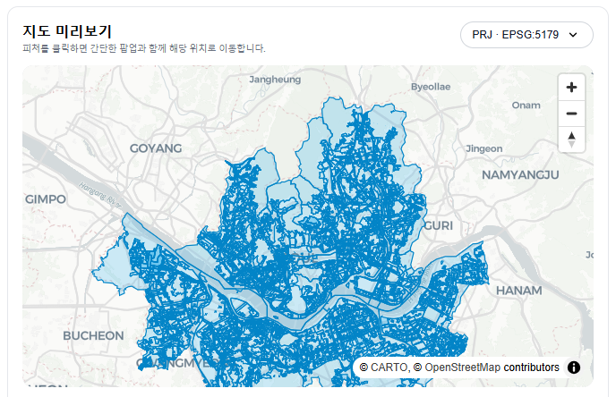</td>
    <td width="50%">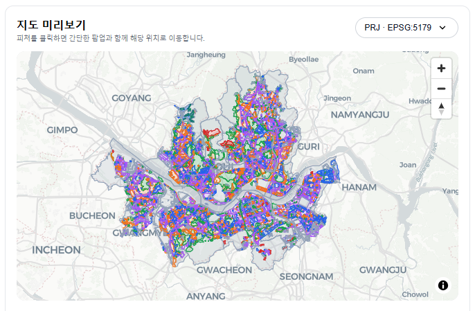</td>
    
  </tr>
  <tr>
    <th width="50%">기본 시각화 옵션</th>
    <th width="50%">포인트 시각화 옵션 </th>
  </tr>
  <tr>
    <td width="50%">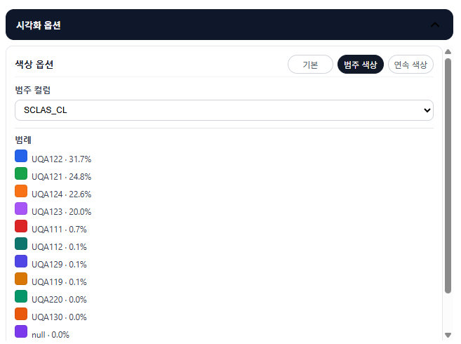</td>
    <td width="50%"></td>
  </tr>
  <tr>
    <th width="50%">크기·클러스터 결과</th>
    <th width="50%">포인트 지도</th>
  </tr>
  <tr>
    <td width="50%">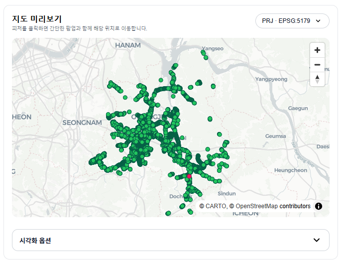</td>
    <td width="50%">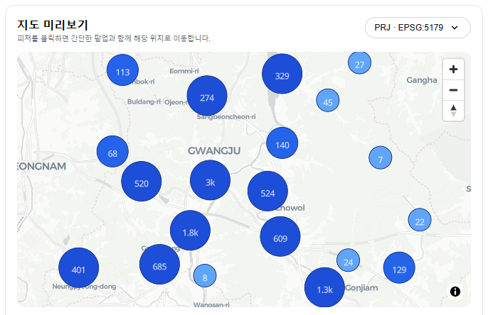</td>
  </tr>
</table>


### 4) 속성 테이블 · 컬럼 채움도 분석
- 대용량 대응 가상 스크롤 테이블
- 컬럼 null 비율/unique 값/샘플 통계
- 지도 ↔ 테이블 항목 동기 하이라이트

<table width="100%">
  <tr>
    <th width="50%">컬럼 요약</th>
    <th width="50%">속성 테이블</th>
  </tr>
  <tr>
    <td width="50%">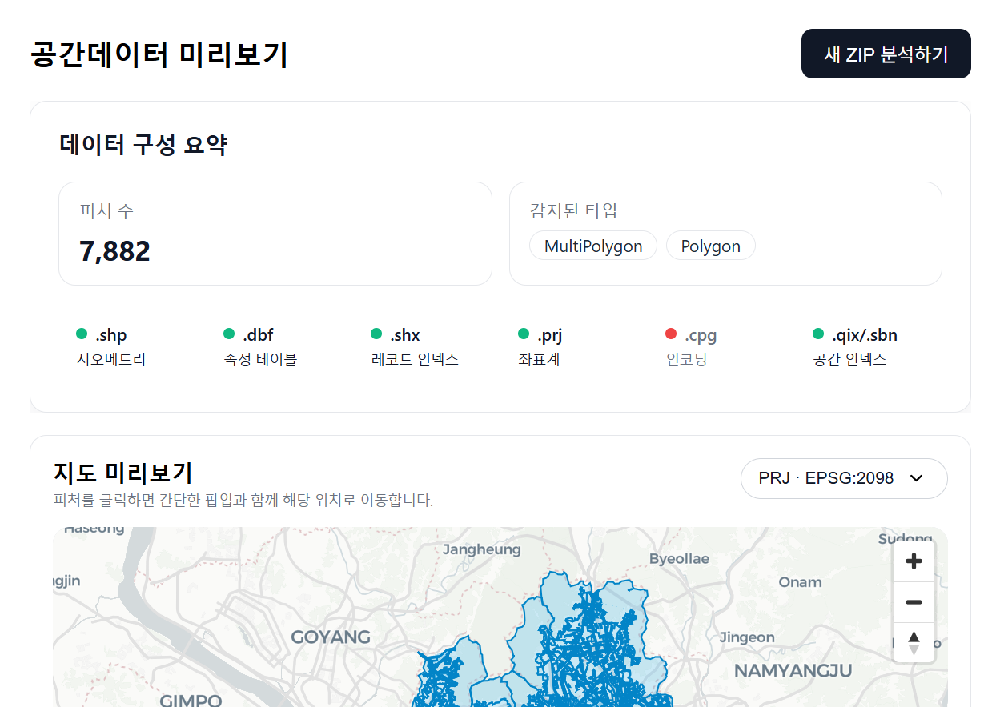</td>
    <td width="50%"></td>

  </tr>
  <tr>
    <th width="50%">컬럼 채움 정도(낮은 %)</th>
    <th width="50%">컬럼 채움 정도(높은 %)</th>

  </tr>
  <tr>
    <td width="50%">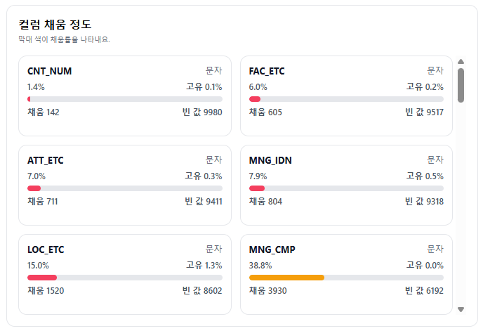</td>
    <td width="50%">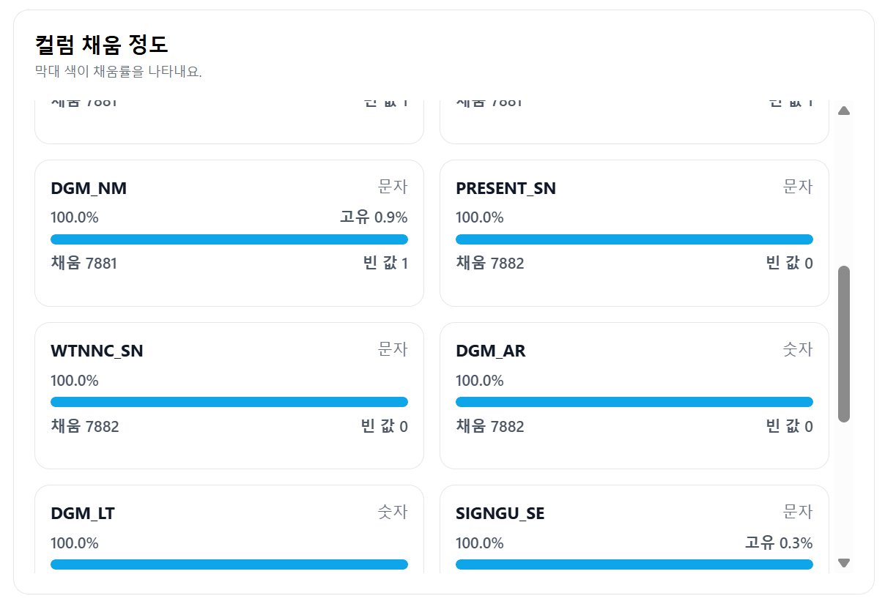</td>
  </tr>
</table>


### 5) 대용량 가드 · 처리 진행 표시
- 100MB 이상 또는 10만 피처 이상 감지 시 경고
- Quick / Full 파싱 모드 제공
- Web Worker 기반 진행률 표시(배너·모달)
<table width="100%">
  <tr>
    <th width="50%">대용량 모드 안내</th>
    <th width="50%">대용량 파싱</th>
  </tr>
  <tr>
    <td width="50%"></td>
    <td width="50%">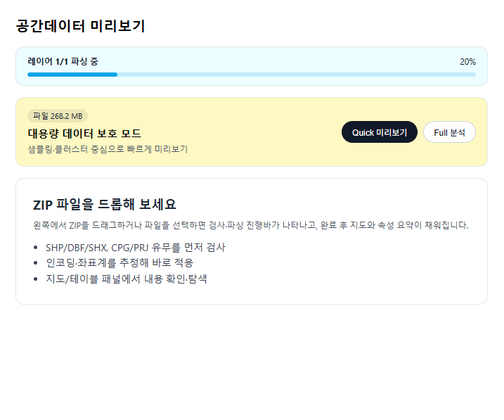</td>
  </tr>
</table>


## 지원/제한 사항
- 입력: `.shp/.dbf/.shx` 필수, `.prj/.cpg` 권장(좌표계·인코딩 자동 감지)
- 좌표계: EPSG 4326/3857/2098/5174/5175/5176/5179/5181/5183/5186 자동 추정·선택 지원
- 용량 가이드: 100MB/10만 피처 이상은 Quick 모드 권장(브라우저 메모리 제약)
- 지도 렌더: 기본 레이어는 geojson-vt 타일 기반(전체 데이터), 클러스터는 샘플 포인트 기반
- 내보내기: GeoJSON/CSV 결과 다운로드 지원하나, 수십만 행 이상은 브라우저 메모리 상황에 따라 느릴 수 있음

## 앞으로 추가할 계획
- 내보내기: GeoJSON/CSV 내보내기(필터/정렬/검색 반영), 큰 결과셋 스트리밍/분할 저장, 파일명·필드 선택 옵션 추가
- 좌표계 확장: 국내외 주요 EPSG 추가 및 PRJ 파싱 보완
- 시각화 보강: 범례 커스터마이즈, 추가 스타일 프리셋, 대용량 클러스터 최적화
