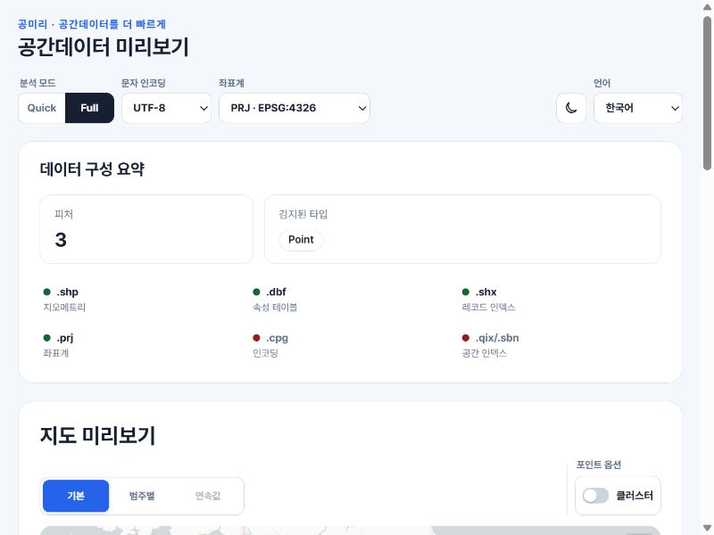
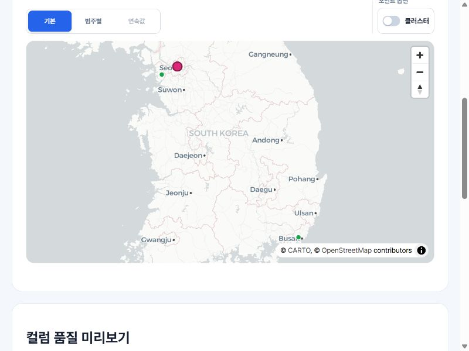
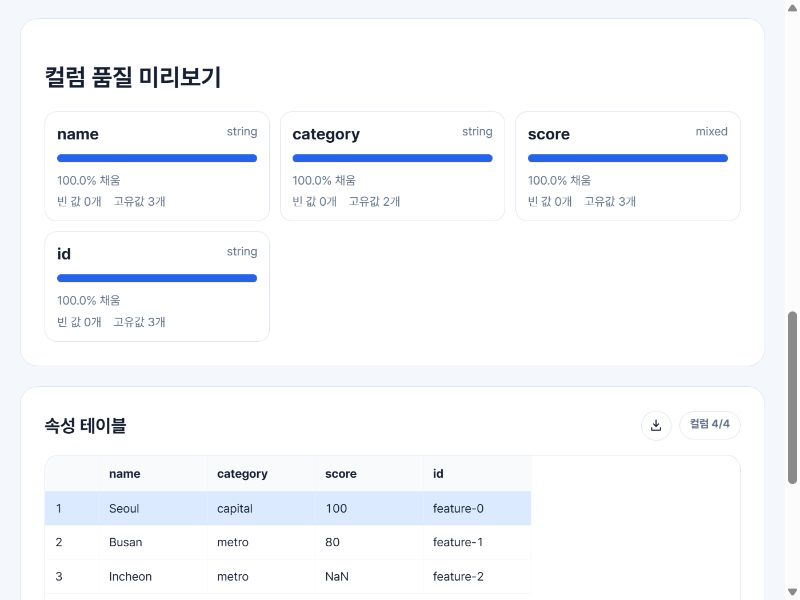
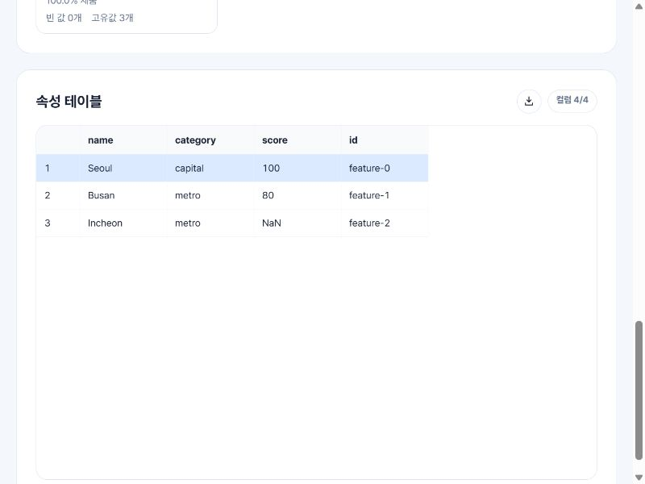

# 🗺️ 공간데이터(SHP/ZIP) 미리보기 확장 프로그램
**Gongmiri**는 다운로드한 Shapefile ZIP을 서버에 올리지 않고 브라우저 안에서 빠르게 검사하는 Chrome Extension입니다. 확장 아이콘으로 팝업 뷰어를 연 뒤 ZIP을 드래그하거나 직접 선택합니다.

[](https://chromewebstore.google.com/detail/apllbcgmjgicgmgfpnkeddjammiellca?utm_source=item-share-cb)
[](https://www.notion.so/GongMiri-Project-2a7eb97891c680b88428e78c322776fc?source=copy_link)

개선 계획과 단계별 완료 조건은 [ROADMAP.md](ROADMAP.md)에서 확인할 수 있습니다.
현재 파서 측정값과 한계는 [성능 기준선](docs/performance-baseline.md)에 기록합니다.
의존성 점검 결과는 [보안 기준선](docs/security-baseline.md)에 기록합니다.

## 왜 만들었나요?

공간데이터 분석을 진행할 때 우리는 주로 SHP(Shapefile) 파일을 다운로드해 활용합니다.

하지만 이 파일 안에 실제로 어떤 데이터가 들어 있는지 확인하는 과정은 생각보다 번거롭습니다.

물론 컬럼 정의서를 통해 각 필드의 의미는 알 수 있습니다.

그러나 **해당 컬럼이 실제 얼마나 채워져 있는지, 유효한 값이 포함되어 있는지**는 또 다른 문제입니다.

예를 들어, 컬럼 구조만 보고 "분석이 가능하겠구나"라고 기대했지만,

막상 QGIS 같은 툴에서 열어보면 값이 대부분 `NULL`이거나, 기대했던 속성이 전혀 없는 경우가 흔합니다.

결국 실제 데이터를 확인하기 위해 매번 아래와 같은 과정을 반복해야 했습니다.

```
ZIP 다운로드 → 압축 해제 → QGIS 실행 → 레이어 추가 → 속성 테이블 확인 → 지도 분포 확인
```

한두 번이라면 괜찮지만, 다양한 데이터를 탐색해야 할 때에는

단순 검증 작업만으로도 많은 시간과 노력이 들고, 워크플로우 또한 비효율적이라는 생각이 들었습니다.

그래서 이러한 불편함을 해결하고자,

**다운로드한 Shapefile을 별도 GIS 프로그램 없이 브라우저에서 열어 속성과 공간 분포를 빠르게 파악할 수 있는 크롬 확장 프로그램**을 만들고자 합니다.

## 설치 및 실행
- 요구사항: Node.js 22+ / npm, Chrome(확장 프로그램 로드용)
- 의존성 설치: `npm ci`
- React UI 개발 서버: `npm run dev:react` 후 표시되는 로컬 주소의 `extension/react-viewer.html`에서 확인
- 확장 번들 빌드: `npm run build` (React·빌드 설정 타입 검사와 산출물 스모크 검사 포함, 결과물은 `dist/`)
- 테스트: `npm test`
- 크롬 확장 로드: `chrome://extensions` → 개발자 모드 ON → "압축해제된 확장 프로그램을 로드" → `dist/` 폴더 선택. 빌드 후 변경 시 확장 페이지에서 "새로고침"을 눌러 반영.

## 주요 기능
- ZIP Drag & Drop / 파일 선택
- SHP / DBF / SHX / PRJ 로딩 및 검증
- DBF 문자 인코딩 자동 판별(CPG 우선)
- PRJ 기반 SRID 자동 추정 (4326/5179/5186/3857 등)
- 웹 워커 기반 비동기 파싱과 SHX 선행 샘플링(대용량 데이터 대응)
- 포인트/라인/폴리곤 자동 스타일링
- 가상 스크롤 속성 테이블과 지도 선택 동기화
- 범주·연속 색상, 포인트 크기, 클러스터 시각화
- 한국어/영어 UI와 확장 메타데이터
- Quick/Full 표시 모드
- 가상 스크롤 속성 테이블의 정렬·컬럼 표시·고정·순서 변경과 지도 동기화
- 전체 결과와 선택한 필드를 Worker 기반 GeoJSON/UTF-8 CSV로 저장
- 선택형 다운로드 ZIP 감지와 시스템 다크 모드

## 기능별 화면 가이드


### 1) ZIP 업로드 · 파일 검사
- Shapefile ZIP Drag & Drop / 파일 선택
- `.shp/.dbf/.shx/(.prj|.cpg)` 필수 구성 검사
- 인코딩(CPG) · 좌표계(PRJ) 자동 감지

<table width="100%">
  <tr>
    <th width="50%">ZIP 업로드</th>
    <th width="50%">데이터 구성 요약</th>
  </tr>
  <tr>
    <td width="50%"></td>
    <td width="50%"></td>
  </tr>
</table>

### 2) 지도 렌더링 · 공간 시각화
- PRJ 기반 EPSG 자동 추정
- 4326 / 5179 / 5186 / 3857 등 사용자 지정 선택
- MapLibre 기반 베이스맵
- 포인트/라인/폴리곤 자동 스타일링과 피처 하이라이트
- 범주·연속 색상, 포인트 크기, 클러스터 보기 모드



### 3) 속성 테이블 · 컬럼 품질 분석
- 대용량 대응 가상 스크롤 테이블
- 컬럼 채움률·빈 값·고유값 요약
- 정렬, 컬럼 표시·고정·순서 변경과 지도 동기 하이라이트

<table width="100%">
  <tr>
    <th width="50%">컬럼 품질</th>
    <th width="50%">속성 테이블</th>
  </tr>
  <tr>
    <td width="50%"></td>
    <td width="50%"></td>
  </tr>
</table>

### 4) GeoJSON · CSV 내보내기
- 전체 결과에서 필요한 컬럼 선택
- UTF-8 BOM CSV와 GeoJSON 저장
- GeoJSON의 WGS84·원본 좌표계 선택


### 5) 대용량 처리
- 100MB·10만 피처·50만 좌표 중 하나를 넘으면 Quick을 기본값으로 선택
- Quick / Full 표시 모드 제공(Quick은 최대 25,000피처를 전체 범위에서 균등 샘플링)
- Web Worker 기반 파싱과 다국어 진행률 표시

## 지원/제한 사항
- 입력: `.shp/.dbf/.shx` 필수, `.prj/.cpg` 권장(좌표계·인코딩 자동 감지)
- 좌표계: EPSG 4326/3857/2098/5174/5175/5176/5179/5181/5183/5186 자동 추정·선택 지원
- 용량 가이드: 100MB 이상, 10만 피처 이상, 50만 좌표 이상 중 하나에 해당하면 Quick 모드가 기본이며 필요하면 Full로 전환할 수 있음
- Quick 모드도 현재는 Worker가 원본 ZIP을 먼저 파싱한 뒤 화면용 피처를 샘플링함
- 지도 렌더: Full은 geojson-vt 타일 기반 전체 데이터, Quick은 최대 25,000피처, 클러스터는 최대 25,000포인트 사용
- 다운로드 ZIP 감지는 선택 권한으로 알림 배지만 제공하며, 보안 제약상 파일을 자동으로 읽거나 분석하지 않음
- 내보내기는 메모리에서 생성하므로 매우 큰 Full 결과는 브라우저 메모리 한계의 영향을 받을 수 있음

## 앞으로 추가할 계획
- 다운로드 연결: Windows Chrome 실사용 유형별 감지 성공률과 실패 원인 검증
- 내보내기: 큰 결과셋 스트리밍/분할 저장과 메모리 오류 안내 보강
- 좌표계 확장: 국내외 주요 EPSG 추가 및 PRJ 파싱 보완
- 시각화 보강: 범례 커스터마이즈, 추가 스타일 프리셋, 대용량 클러스터 최적화
